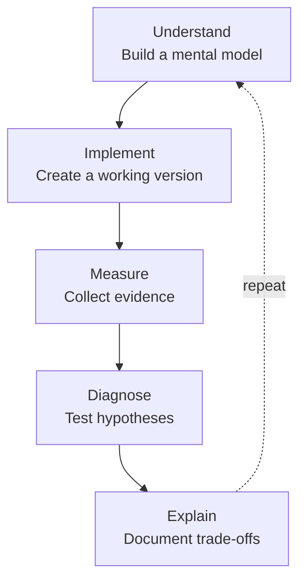
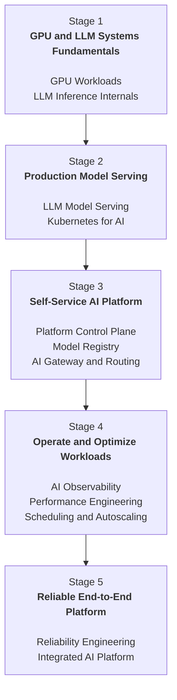
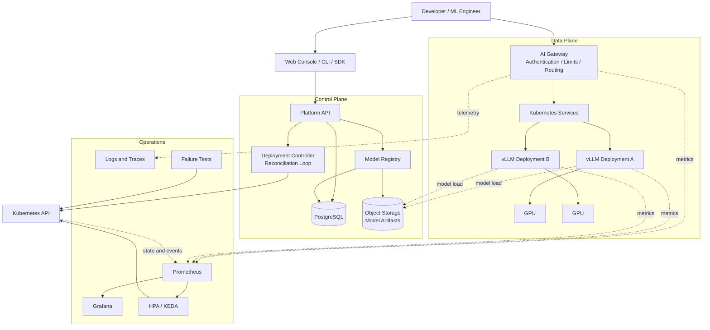
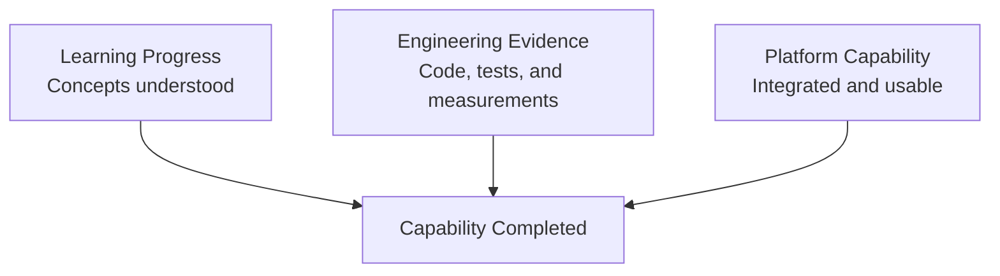

# AI Infrastructure Learning Roadmap

This repository documents how I plan to build practical AI Infrastructure skills by designing and implementing an end-to-end, self-service LLM inference platform.

The roadmap is organized by capabilities rather than deadlines. It explains the concepts, engineering work, and system-design progression needed to move from GPU fundamentals to a reliable AI platform.

## Overview

AI Infrastructure sits at the intersection of software engineering, distributed systems, cloud infrastructure, GPU computing, and machine learning systems.

My goal is to understand the complete path from a model artifact to a reliable production-style service:

```text
Model Artifact
      ↓
Model Serving
      ↓
Kubernetes Deployment
      ↓
Platform Control Plane
      ↓
Gateway and Routing
      ↓
Observability and Performance
      ↓
Autoscaling and Reliability
```

The final project will allow a developer to register, deploy, invoke, monitor, benchmark, scale, and stop an LLM deployment without managing Kubernetes resources directly.

## Learning Objectives

Through this roadmap, I want to be able to:

- Explain how LLM workloads use GPU compute, memory, and bandwidth.
- Estimate model weights, KV cache, and runtime GPU memory requirements.
- Build and benchmark an OpenAI-compatible inference service.
- Deploy GPU-backed model servers on Kubernetes.
- Design a platform control plane and deployment reconciliation loop.
- Manage model identity, versioning, artifacts, and deployment lifecycle.
- Build an AI gateway with authentication, routing, rate limiting, and timeout handling.
- Observe application, model-serving, GPU, and cluster behavior together.
- Find saturation points and diagnose performance bottlenecks through controlled experiments.
- Design workload-aware autoscaling and reason about GPU scheduling constraints.
- Test failure scenarios and measure service recovery.
- Explain system trade-offs using code, metrics, and experimental evidence.

## Learning Approach

I will use the same cycle for each topic:



A topic is not complete because I read about it or made a service start successfully. Completion requires:

- A clear explanation of the underlying mechanism.
- A reproducible implementation or experiment.
- Measurements, tests, or failure evidence.
- Written findings and known limitations.
- A connection to the final platform.

## Roadmap



---

## Stage 1 — GPU and LLM Systems Fundamentals

### Outcome

Develop a systems-level understanding of how LLM inference uses GPU compute and memory, then validate that understanding through measurement.

### Topic: GPU and AI Workload Fundamentals

#### Why it matters

High GPU memory usage, low utilization, or slow inference can have very different causes. Diagnosing them requires understanding the relationship between compute units, HBM capacity, memory bandwidth, batching, and data movement.

#### What this covers

- Compare CPU and GPU execution models.
- Explain SMs, CUDA cores, Tensor Cores, HBM, cache, and memory bandwidth.
- Distinguish compute-bound, memory-bound, and transfer-bound workloads.
- Explain how FP32, FP16, BF16, and FP8 affect memory and compute.
- Understand benchmark warm-up, synchronization, and measurement noise.

#### Practical work

- Build a CPU versus GPU matrix multiplication benchmark.
- Compare multiple matrix sizes, precisions, and batch sizes.
- Record runtime, throughput, and memory usage.
- Build an `aip benchmark gpu` CLI.

#### Questions I should be able to answer

- GPU memory is at 95%, but utilization is only 30%. What could be happening?
- Why does high GPU utilization not necessarily mean high serving efficiency?
- Why do GPU benchmarks require warm-up and synchronization?
- Why might lower precision fail to improve end-to-end latency?

#### Platform integration

The benchmark CLI will become the first component of the platform's performance toolkit.

### Topic: LLM Internals and GPU Memory

#### Why it matters

LLM serving capacity depends on more than model size. Prefill, decode, KV cache, context length, output length, and concurrency produce different compute and memory behavior.

#### What this covers

- Trace tokenization, prefill, decode, sampling, and autoregressive generation.
- Distinguish time to first token from time per output token.
- Explain the purpose and lifecycle of the KV cache.
- Estimate model weight memory from parameter count and precision.
- Separate weights, activations, temporary buffers, and KV cache.
- Explain quantization trade-offs and runtime compatibility constraints.

#### Practical work

- Measure model memory before load, after load, and during generation.
- Change context length, output length, and concurrency.
- Compare a full-precision and quantized configuration.
- Build an `aip estimate` memory calculator.

#### Questions I should be able to answer

- Why does prompt length primarily affect prefill and TTFT?
- Why is `parameter count × bytes` insufficient for capacity planning?
- How does KV cache limit concurrency?
- Why is an INT4 model not always faster than an FP16 model?

#### Platform integration

The estimator will become a preflight validation step before the platform creates a deployment.

### What completing Stage 1 means

- I can explain GPU execution and LLM memory behavior without notes.
- My benchmark and memory estimator are reproducible.
- I can form multiple hypotheses from GPU and serving metrics.
- My conclusions are supported by measurements.

---

## Stage 2 — Production Model Serving

### Outcome

Turn a model artifact into a reproducible, OpenAI-compatible inference service that can be deployed and managed on Kubernetes.

### Topic: LLM Model Serving

#### Why it matters

Generating text in a notebook is different from serving concurrent users. A serving system must manage queues, scheduling, continuous batching, streaming, cancellation, timeouts, and client-visible latency.

#### What this covers

- Trace the complete inference request lifecycle.
- Build a Hugging Face inference baseline.
- Serve the same model through vLLM.
- Explain continuous batching and PagedAttention.
- Support OpenAI-compatible requests and token streaming.
- Define TTFT, TPOT, end-to-end latency, throughput, and goodput.

#### Practical work

- Compare Hugging Face and vLLM using the same model and workload.
- Build a concurrent load generator.
- Test multiple concurrency levels.
- Measure latency, TTFT, TPOT, tokens per second, and errors.
- Package the service in a reproducible container.

#### Questions I should be able to answer

- How does continuous batching differ from request-level batching?
- What latency does streaming improve?
- Why can throughput improve while P95 latency becomes worse?
- What should happen when a streaming client disconnects?

#### Platform integration

The vLLM container will become the main inference workload managed by the platform.

### Topic: Kubernetes for AI

#### Why it matters

Model servers have long startup times, large artifacts, and scarce GPU requirements. Their health and rollout behavior differ from ordinary stateless web services.

#### What this covers

- Understand Pods, Deployments, Services, configuration, secrets, and storage.
- Configure GPU resource requests and node scheduling.
- Distinguish startup, readiness, and liveness probes.
- Design model-loading and caching behavior.
- Understand graceful termination and rollout behavior.
- Diagnose pending Pods, failed loads, and restart loops.

#### Practical work

- Deploy the inference container as a GPU-backed workload.
- Add a stable Service and health probes.
- Compare cached and uncached model startup.
- Simulate an invalid model path and a Pod restart.
- Package reusable Kubernetes manifests or a Helm chart.

#### Questions I should be able to answer

- Why should liveness not depend only on model readiness?
- Why does a Running Pod not guarantee a usable endpoint?
- How does a long model-loading time affect rolling deployment?
- What happens when the requested GPU cannot be scheduled?

#### Platform integration

The deployment template will become the workload definition created by the control plane.

### What completing Stage 2 means

- A clean environment can start the model server from documented configuration.
- The service supports streaming and concurrent requests.
- Kubernetes sends traffic only to ready instances.
- Failed model loads and restarts are visible and diagnosable.

---

## Stage 3 — Self-Service AI Platform

### Outcome

Allow a developer who does not know Kubernetes to register, deploy, inspect, invoke, and stop a model through a stable platform interface.

### Topic: Platform Control Plane

#### Why it matters

A platform should hide infrastructure details behind a declarative API. The user describes the desired state, while the control plane creates resources, observes actual state, and reconciles differences.

#### What this covers

- Define control-plane and data-plane responsibilities.
- Design a deployment API and persistence model.
- Implement create, get, restart, and delete operations.
- Store deployment metadata and state in PostgreSQL.
- Integrate with the Kubernetes API.
- Build an idempotent reconciliation loop.

#### Practical work

- Draw the API, database, controller, and Kubernetes sequence.
- Test repeated requests and partial failures.
- Restart the control plane and recover existing state.
- Verify that reconciliation does not create duplicate workloads.

#### Questions I should be able to answer

- What status should be returned before the Kubernetes workload is ready?
- How does the control plane recover after a crash?
- Which system is the source of truth when the database and cluster disagree?
- How should delete behave when it is retried?

#### Platform integration

This becomes the core orchestration layer for all later capabilities.

### Topic: Model Registry and Lifecycle

#### Why it matters

A model name alone is not sufficient for reproducible deployment. The platform needs immutable versions, artifact identity, compatibility metadata, and explicit lifecycle transitions.

#### What this covers

- Define Model, ModelVersion, Artifact, Deployment, and Endpoint.
- Separate immutable versions from mutable aliases.
- Implement registration, listing, and version lookup.
- Connect the registry to object storage.
- Define deployment lifecycle states and valid transitions.
- Record checksums, runtime, precision, tokenizer, and context metadata.

#### Practical work

- Test duplicate versions and missing artifacts.
- Reject incompatible runtime configurations.
- Complete a register, deploy, stop, and redeploy flow.

#### Questions I should be able to answer

- How does a model version differ from a deployment version?
- How can artifact overwrites break reproducibility?
- Who owns lifecycle transitions?
- Is a model registry a metadata database, an artifact store, or both?

#### Platform integration

Deployments will reference registered model versions instead of arbitrary paths.

### Topic: AI Gateway and Routing

#### Why it matters

Clients should not depend on Pod addresses or deployment details. The gateway provides a stable interface and centralizes authentication, routing, limits, timeout policies, and request telemetry.

#### What this covers

- Route logical model names to healthy deployments.
- Implement an OpenAI-compatible endpoint.
- Authenticate clients using API keys.
- Apply request, token, or concurrency limits.
- Define connect, request, and streaming timeouts.
- Use bounded retries, backoff, and jitter where safe.
- Propagate correlation IDs across services.

#### Practical work

- Route requests to two different model deployments.
- Test invalid credentials, rate limits, timeouts, and upstream errors.
- Measure gateway overhead.
- Test streaming cancellation and partial responses.

#### Questions I should be able to answer

- Can a partially streamed response be retried safely?
- Should rate limiting count requests, tokens, concurrent work, or cost?
- How does the gateway avoid stale or unhealthy endpoints?
- How can retries cause a cascading failure?

#### Platform integration

The gateway becomes the platform's single client-facing inference entry point.

### What completing Stage 3 means

A developer should be able to use a workflow similar to:

```bash
aip model register qwen --artifact <artifact-uri>
aip deploy qwen --gpu 1
aip status
```

Then invoke the model using a normal OpenAI client without accessing Kubernetes directly.

- Models can be registered and versioned.
- Deployments can be created, inspected, restarted, and stopped.
- The platform exposes consistent lifecycle state.
- The gateway routes authenticated requests using logical model names.

---

## Stage 4 — Operate and Optimize AI Workloads

### Outcome

Observe the entire request path, reproduce workload behavior, identify bottlenecks, and adjust capacity using workload-aware signals.

### Topic: AI Observability

#### Why it matters

Diagnosing AI systems requires traditional service metrics and model-specific signals. A slow request may be caused by the gateway, queue, scheduler, model runtime, GPU, storage, or network.

#### What this covers

- Track request rate, errors, and latency percentiles.
- Track TTFT, TPOT, token counts, queue depth, and KV cache usage.
- Track GPU utilization, memory, temperature, and power.
- Track deployment state, ready replicas, startup time, and reconciliation errors.
- Define metric units, label policy, and histogram buckets.
- Correlate structured logs and traces with request IDs.

#### Practical work

- Instrument the control plane and gateway.
- Expose model-serving and queue metrics.
- Integrate NVIDIA DCGM metrics.
- Create service, model, and GPU dashboards.
- Trace a slow request across components.

#### Questions I should be able to answer

- What does a healthy average latency with a poor P99 suggest?
- Why should user IDs not be Prometheus labels?
- Does 80% GPU utilization represent efficiency or saturation?
- When should I use logs, metrics, or traces?

#### Platform integration

The resulting telemetry will support performance testing, autoscaling, and failure validation.

### Topic: Performance Engineering

#### Why it matters

Performance work requires controlled workloads and reproducible evidence. Tuning without a methodology can mistake warm-up, client limits, traffic distribution, or measurement noise for a real improvement.

#### What this covers

- Define workload, warm-up, duration, concurrency, and success criteria.
- Distinguish throughput, goodput, latency, utilization, and cost efficiency.
- Test multiple prompt lengths, output lengths, and concurrency levels.
- Identify saturation and queue-growth behavior.
- Use a hypothesis, experiment, result, and conclusion structure.
- Understand coordinated omission and load-generator bottlenecks.

#### Practical work

- Build a configurable endpoint benchmark tool.
- Run concurrency and context-length experiments.
- Correlate request latency with queues, GPU utilization, memory, and KV cache.
- Run at least one before-and-after optimization experiment.

#### Questions I should be able to answer

- Why can higher throughput produce lower SLO goodput?
- How can I prove that the load generator is not the bottleneck?
- Why are equal average prompt lengths insufficient for workload comparison?
- How do I separate a real improvement from measurement noise?

#### Platform integration

Benchmarks will be linked to model, deployment, configuration, and code versions.

### Topic: Scheduling and Autoscaling

#### Why it matters

LLM replicas are expensive and slow to initialize. CPU utilization often fails to reflect inference pressure, while queue-based scaling can react too late without capacity headroom and backpressure.

#### What this covers

- Compare HPA, KEDA, and custom metrics.
- Understand scaling targets, stabilization, cooldown, and hysteresis.
- Scale using queue depth or pending requests.
- Measure cold-start and model-loading delay.
- Use node selectors, taints, tolerations, and affinity.
- Understand GPU fragmentation, bin packing, and MIG concepts.

#### Practical work

- Create an application-metric autoscaling baseline.
- Run queue-aware scale-out and scale-in experiments.
- Measure signal detection, scheduling, model loading, and readiness separately.
- Test GPU placement constraints.

#### Questions I should be able to answer

- Why can CPU-based HPA fail for LLM serving?
- Is scaling after queue growth already too late?
- What happens to active streams during scale-in?
- Why can apparently free GPUs still be unusable for a pending workload?

#### Platform integration

Autoscaling policy will become part of the deployment configuration and platform console.

### What completing Stage 4 means

- Dashboards connect traffic, model-serving, GPU, and platform state.
- A benchmark can reproduce the serving saturation point.
- At least one optimization has before-and-after evidence.
- Autoscaling behavior is measured from signal to ready capacity.

---

## Stage 5 — Reliable End-to-End Platform

### Outcome

Deliver an integrated platform that can demonstrate controlled load, scaling, failure detection, and recovery while clearly communicating its limitations.

### Topic: Reliability and Failure Engineering

#### Why it matters

Reliability requires more than automatic Pod restart. The system must remove unhealthy instances from routing, bound queues and retries, expose correct state, and fail predictably under resource exhaustion.

#### What this covers

- Define service-level indicators and objectives.
- Build a component failure matrix.
- Implement readiness removal and graceful request draining.
- Use timeouts, bounded retries, backoff, jitter, and backpressure.
- Distinguish transient, permanent, dependency, and overload failures.
- Measure detection, traffic removal, and recovery time.

#### Practical work

- Kill a serving Pod under load.
- Simulate an invalid model artifact.
- Trigger memory pressure and request timeouts.
- Test graceful shutdown with active streaming requests.
- Build a reusable failure-injection runner.

#### Questions I should be able to answer

- Why might a terminating Pod continue to receive traffic briefly?
- Should an OOM kill and an application exception use the same recovery policy?
- How can retries amplify a partial outage?
- How long should graceful shutdown wait for a streaming request?

#### Platform integration

Failure tests and recovery evidence will become part of the final platform demo.

### Topic: Integrated AI Infrastructure Platform

#### Final workflow

- Register a versioned model artifact.
- Create a deployment through the platform API, CLI, or UI.
- Observe deployment lifecycle and readiness.
- Invoke the model through the gateway.
- Inspect service, token, queue, and GPU metrics.
- Run a repeatable load test.
- Observe scaling behavior.
- Inject a serving failure and observe recovery.
- Stop the deployment and clean up resources.

#### Final platform capabilities

##### Functional

- Model registration and version lookup work.
- Deployment create, inspect, restart, and stop operations work.
- Gateway routing, authentication, rate limiting, and streaming work.
- At least two logical models can be routed independently.

##### Performance and observability

- A fixed-workload baseline is available.
- P50/P95/P99, TTFT, TPOT, tokens per second, queue depth, and errors are visible.
- GPU utilization and memory are visible.
- The saturation point and at least one optimization are documented.

##### Reliability

- Unhealthy instances stop receiving new traffic.
- Invalid artifacts reach a failed state instead of remaining stuck.
- OOM, timeout, and overload have bounded behavior.
- At least three failure scenarios include measured recovery evidence.

##### Documentation

- The repository explains the problem, architecture, setup, and workflows.
- Architecture diagrams match the implementation.
- Design decisions, limitations, and future improvements are documented.
- The project does not contain credentials or private model tokens.

### What completing Stage 5 means

- A new user can follow the documentation and complete a basic workflow.
- The complete demonstration is repeatable.
- I can explain at least three design decisions and their trade-offs.
- I can identify the system's main reliability, security, and scalability gaps.

---

## Final Platform Architecture



## Suggested Technology Stack

| Layer | Tools I plan to explore |
|---|---|
| API and services | Python, FastAPI, Pydantic |
| Developer interface | Typer or Click |
| Model baseline | PyTorch, Hugging Face Transformers |
| Model serving | vLLM |
| Containers | Docker |
| Orchestration | Kubernetes, Helm |
| Metadata | PostgreSQL, SQLAlchemy, Alembic |
| Artifact storage | S3-compatible storage or MinIO |
| Metrics | Prometheus, NVIDIA DCGM Exporter |
| Visualization | Grafana |
| Logs and traces | OpenTelemetry, structured JSON logs |
| Autoscaling | HPA, KEDA, Prometheus Adapter |
| Testing | pytest, httpx, Testcontainers |
| Automation | GitHub Actions |

These are starting choices, not fixed requirements. I will document changes when experiments reveal a better fit.

## Repository Structure

```text
ai-infra-platform/
├── apps/
│   ├── control-plane/
│   ├── gateway/
│   └── console/
├── serving/
│   ├── baseline-hf/
│   └── vllm/
├── packages/
│   ├── aip-cli/
│   ├── benchmark/
│   └── memory-estimator/
├── deploy/
│   ├── docker/
│   ├── kubernetes/
│   └── helm/
├── observability/
│   ├── prometheus/
│   ├── grafana/
│   └── otel/
├── tests/
│   ├── unit/
│   ├── integration/
│   ├── performance/
│   └── failure/
├── docs/
│   ├── architecture/
│   ├── experiments/
│   ├── benchmarks/
│   ├── runbooks/
│   └── learning-notes/
└── README.md
```

The structure will evolve with the implementation. I will add directories only when the related component exists.

## Final Self-Assessment Questions

I consider this roadmap successful when I can answer these questions using diagrams, system behavior, and measurements rather than definitions alone:

1. GPU memory is nearly full, utilization is low, and the request queue is growing. What hypotheses should I test?
2. How do prefill and decode differ in workload behavior and optimization opportunities?
3. What problems do continuous batching and PagedAttention solve?
4. How does a model deployment move from an API request to a ready endpoint?
5. How does reconciliation recover from database and Kubernetes state differences?
6. How should a gateway handle streaming, cancellation, timeout, retries, and rate limits?
7. Which signals distinguish queue, runtime, GPU, storage, and network bottlenecks?
8. What makes an LLM benchmark reproducible and representative?
9. Why can CPU-based autoscaling be ineffective for LLM serving?
10. How should the platform respond to a Pod crash, model-loading failure, or GPU OOM?
11. Where are the main single points of failure and security gaps?
12. If traffic increases significantly, how should I choose between scaling, optimization, and admission control?

## Completion Principle



The roadmap is complete only when the learning, implementation, and evidence agree. A checked task without a working system or an explanation supported by measurements does not represent completed capability.
