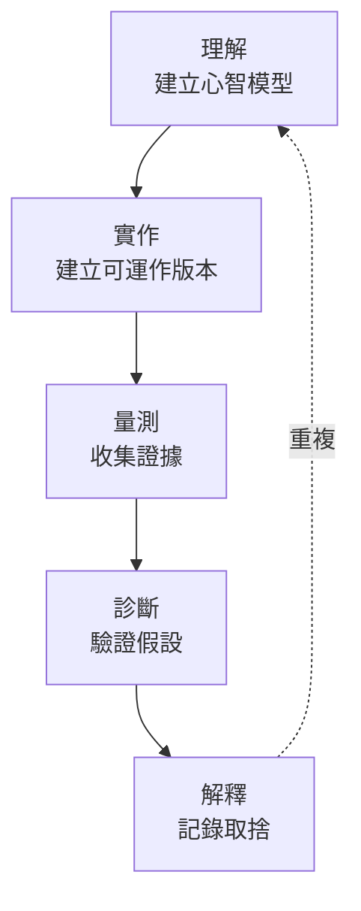
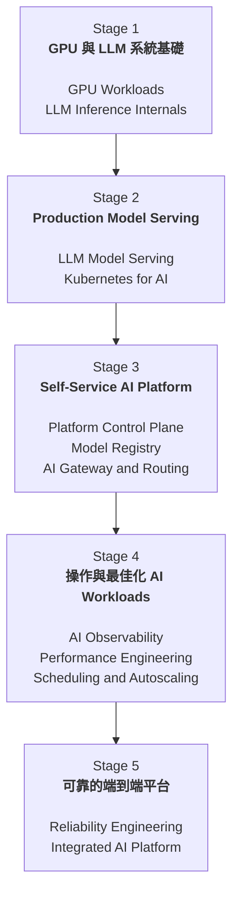
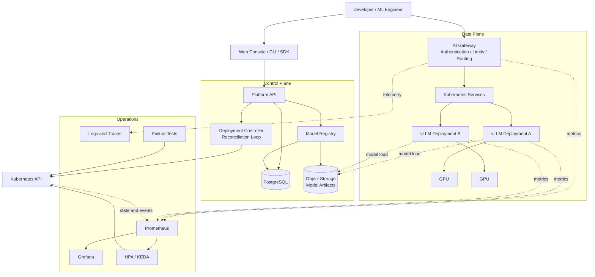
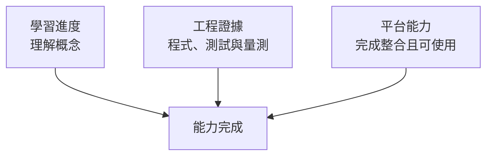

# AI Infrastructure 學習路線圖

[English](README.md) | **繁體中文**

這個 repository 記錄我如何透過設計與實作一套端到端、自助式的 LLM inference platform，建立實用的 AI Infrastructure 能力。

這份路線圖以「能力」而非期限組織，涵蓋從 GPU 基礎到可靠 AI 平台所需的概念、工程實作與系統設計演進。

## 概覽

AI Infrastructure 位於軟體工程、分散式系統、雲端基礎設施、GPU computing 與 machine learning systems 的交會處。

我的目標是理解 model artifact 到 production-style service 的完整路徑：

```text
Model Artifact
      ↓
Model Serving
      ↓
Kubernetes Deployment
      ↓
Platform Control Plane
      ↓
Gateway and Routing
      ↓
Observability and Performance
      ↓
Autoscaling and Reliability
```

最終專案將讓開發者不需直接管理 Kubernetes resources，也能註冊、部署、呼叫、監控、benchmark、擴縮與停止 LLM deployment。

## 學習目標

完成這份路線圖後，我希望能夠：

- 解釋 LLM workload 如何使用 GPU compute、memory 與 bandwidth。
- 估算 model weights、KV cache 與 runtime GPU memory requirements。
- 建立並 benchmark OpenAI-compatible inference service。
- 在 Kubernetes 部署 GPU-backed model server。
- 設計 platform control plane 與 deployment reconciliation loop。
- 管理 model identity、version、artifact 與 deployment lifecycle。
- 建立具備 authentication、routing、rate limiting 與 timeout handling 的 AI gateway。
- 同時觀察 application、model serving、GPU 與 cluster 行為。
- 透過受控實驗找出 saturation point 並診斷 performance bottleneck。
- 設計 workload-aware autoscaling，並理解 GPU scheduling constraints。
- 測試 failure scenarios 並量測 service recovery。
- 用程式、metrics 與實驗證據解釋系統取捨。

## 學習方法

每個主題都使用相同循環：



只讀完資料或成功啟動服務，不代表主題完成。完成標準包括：

- 能清楚解釋底層機制。
- 有可重現的 implementation 或 experiment。
- 有 measurements、tests 或 failure evidence。
- 有書面 findings 與已知限制。
- 能與最終平台能力連結。

## 路線圖



---

## Stage 1 — GPU 與 LLM 系統基礎

### 成果

從系統層理解 LLM inference 如何使用 GPU compute 與 memory，並透過量測驗證理解。

### 主題：GPU 與 AI Workload 基礎

#### 為什麼重要

GPU memory usage 高、utilization 低或 inference 緩慢，可能來自完全不同的原因。診斷時必須理解 compute units、HBM capacity、memory bandwidth、batching 與 data movement 的關係。

#### 涵蓋內容

- 比較 CPU 與 GPU execution model。
- 解釋 SM、CUDA cores、Tensor Cores、HBM、cache 與 memory bandwidth。
- 區分 compute-bound、memory-bound 與 transfer-bound workloads。
- 解釋 FP32、FP16、BF16、FP8 對 memory 與 compute 的影響。
- 理解 benchmark warm-up、synchronization 與 measurement noise。

#### 實作練習

- 建立 CPU vs GPU matrix multiplication benchmark。
- 比較多種 matrix size、precision 與 batch size。
- 記錄 runtime、throughput 與 memory usage。
- 建立 `aip benchmark gpu` CLI。

#### 應能回答的問題

- GPU memory 95%，但 utilization 只有 30%，可能發生什麼事？
- 為什麼 GPU utilization 高不代表 serving efficiency 高？
- GPU benchmark 為什麼需要 warm-up 與 synchronization？
- 為什麼降低 precision 不一定改善 end-to-end latency？

#### 平台整合

Benchmark CLI 將成為平台 performance toolkit 的第一個元件。

### 主題：LLM Internals 與 GPU Memory

#### 為什麼重要

LLM serving capacity 不只取決於 model size。Prefill、decode、KV cache、context length、output length 與 concurrency 會產生不同的 compute 與 memory 行為。

#### 涵蓋內容

- 追蹤 tokenization、prefill、decode、sampling 與 autoregressive generation。
- 區分 time to first token 與 time per output token。
- 解釋 KV cache 的目的與生命週期。
- 從 parameter count 與 precision 估算 model weight memory。
- 區分 weights、activations、temporary buffers 與 KV cache。
- 解釋 quantization trade-offs 與 runtime compatibility constraints。

#### 實作練習

- 量測 model load 前、load 後與 generation 時的 memory。
- 改變 context length、output length 與 concurrency。
- 比較 full-precision 與 quantized configuration。
- 建立 `aip estimate` memory calculator。

#### 應能回答的問題

- 為什麼 prompt length 主要影響 prefill 與 TTFT？
- 為什麼 `parameter count × bytes` 不足以進行 capacity planning？
- KV cache 如何限制 concurrency？
- 為什麼 INT4 model 不一定比 FP16 model 快？

### Stage 1 完成標準

- 不看筆記也能解釋 GPU execution 與 LLM memory behavior。
- Benchmark 與 memory estimator 可重現。
- 能根據 GPU 與 serving metrics 提出多個可驗證假設。
- 結論有 measurements 支持。

---

## Stage 2 — Production Model Serving

### 成果

把 model artifact 轉換成可重現、OpenAI-compatible，且可在 Kubernetes 管理的 inference service。

### 主題：LLM Model Serving

#### 為什麼重要

在 notebook 產生文字和同時服務多個使用者不同。Serving system 必須處理 queue、scheduling、continuous batching、streaming、cancellation、timeout 與 client-visible latency。

#### 涵蓋內容

- 追蹤完整 inference request lifecycle。
- 建立 Hugging Face inference baseline。
- 以 vLLM 服務相同模型。
- 解釋 continuous batching 與 PagedAttention。
- 支援 OpenAI-compatible requests 與 token streaming。
- 定義 TTFT、TPOT、end-to-end latency、throughput 與 goodput。

#### 實作練習

- 以相同 model 與 workload 比較 Hugging Face 和 vLLM。
- 建立 concurrent load generator。
- 測試不同 concurrency levels。
- 量測 latency、TTFT、TPOT、tokens/s 與 errors。
- 將服務包裝成可重現的 container。

#### 應能回答的問題

- Continuous batching 與 request-level batching 有何不同？
- Streaming 改善的是哪種 latency？
- 為什麼 throughput 提高時 P95 latency 可能惡化？
- Streaming client 中斷時應如何處理？

### 主題：Kubernetes for AI

#### 為什麼重要

Model server 啟動時間長、artifact 大，且需要稀缺 GPU。它的 health 與 rollout 行為不同於一般 stateless web service。

#### 涵蓋內容

- 理解 Pods、Deployments、Services、configuration、secrets 與 storage。
- 設定 GPU resource requests 與 node scheduling。
- 區分 startup、readiness 與 liveness probes。
- 設計 model loading 與 caching behavior。
- 理解 graceful termination 與 rollout behavior。
- 診斷 pending Pods、failed loads 與 restart loops。

#### 實作練習

- 部署 GPU-backed inference workload。
- 加入穩定 Service 與 health probes。
- 比較 cached 與 uncached model startup。
- 模擬 invalid model path 與 Pod restart。
- 建立 reusable Kubernetes manifests 或 Helm chart。

#### 應能回答的問題

- 為什麼 liveness 不應只依賴 model readiness？
- 為什麼 Running Pod 不保證 endpoint 可用？
- 長時間 model loading 如何影響 rolling deployment？
- 要求的 GPU 無法排程時會發生什麼事？

### Stage 2 完成標準

- 乾淨環境能依文件啟動 model server。
- Service 支援 streaming 與 concurrent requests。
- Kubernetes 只把流量送往 ready instances。
- Failed model loads 與 restarts 可被觀察與診斷。

---

## Stage 3 — Self-Service AI Platform

### 成果

讓不熟悉 Kubernetes 的開發者也能透過穩定介面註冊、部署、檢查、呼叫與停止模型。

### 主題：Platform Control Plane

#### 為什麼重要

平台應以 declarative API 隱藏 infrastructure details。使用者描述 desired state，control plane 負責建立 resources、觀察 actual state 並 reconciliation。

#### 涵蓋與實作

- 定義 control-plane 與 data-plane responsibilities。
- 設計 deployment API 與 persistence model。
- 實作 create、get、restart、delete operations。
- 在 PostgreSQL 儲存 deployment metadata 與 state。
- 整合 Kubernetes API。
- 建立 idempotent reconciliation loop。
- 測試 repeated requests、partial failures 與 control-plane restart recovery。

#### 應能回答的問題

- Kubernetes workload 尚未 ready 前 API 應回傳什麼狀態？
- Control plane crash 後如何恢復？
- Database 與 cluster 不一致時，誰是 source of truth？
- Delete 被重試時應如何處理？

### 主題：Model Registry 與 Lifecycle

#### 為什麼重要

只有 model name 不足以重現 deployment。平台需要 immutable versions、artifact identity、compatibility metadata 與明確 lifecycle transitions。

#### 涵蓋與實作

- 定義 Model、ModelVersion、Artifact、Deployment 與 Endpoint。
- 區分 immutable version 與 mutable alias。
- 實作 registration、listing 與 version lookup。
- 連接 registry 與 object storage。
- 定義 deployment lifecycle states 與合法 transitions。
- 記錄 checksum、runtime、precision、tokenizer 與 context metadata。
- 測試 duplicate versions、missing artifacts 與 incompatible runtime configuration。

### 主題：AI Gateway 與 Routing

#### 為什麼重要

Client 不應依賴 Pod address 或 deployment details。Gateway 提供穩定介面，集中處理 authentication、routing、limits、timeout policy 與 request telemetry。

#### 涵蓋與實作

- 將 logical model names route 到 healthy deployments。
- 實作 OpenAI-compatible endpoint。
- 使用 API keys 驗證 client。
- 套用 request、token 或 concurrency limits。
- 定義 connect、request 與 streaming timeouts。
- 在安全情境下使用 bounded retries、backoff 與 jitter。
- 跨服務傳遞 correlation IDs。
- 測試 invalid credentials、rate limits、timeouts、upstream errors 與 streaming cancellation。

#### 應能回答的問題

- 已部分 streaming 的 response 能安全 retry 嗎？
- Rate limiting 應計算 requests、tokens、concurrent work 還是 cost？
- Gateway 如何避開 stale 或 unhealthy endpoints？
- Retry 如何造成 cascading failure？

### Stage 3 完成標準

開發者應能使用類似流程：

```bash
aip model register qwen --artifact <artifact-uri>
aip deploy qwen --gpu 1
aip status
```

並透過一般 OpenAI client 呼叫模型，而不需直接存取 Kubernetes。

- Models 可被註冊與 versioned。
- Deployments 可建立、檢查、重啟與停止。
- 平台提供一致的 lifecycle state。
- Gateway 能以 logical model names route authenticated requests。

---

## Stage 4 — 操作與最佳化 AI Workloads

### 成果

觀察完整 request path、重現 workload behavior、辨識 bottleneck，並以 workload-aware signals 調整 capacity。

### 主題：AI Observability

#### 為什麼重要

診斷 AI systems 同時需要傳統 service metrics 與 model-specific signals。Slow request 可能源自 gateway、queue、scheduler、runtime、GPU、storage 或 network。

#### 涵蓋與實作

- 追蹤 request rate、errors 與 latency percentiles。
- 追蹤 TTFT、TPOT、token counts、queue depth 與 KV cache usage。
- 追蹤 GPU utilization、memory、temperature 與 power。
- 追蹤 deployment state、ready replicas、startup time 與 reconciliation errors。
- 定義 metric units、label policy 與 histogram buckets。
- 以 request IDs 串聯 structured logs 與 traces。
- 整合 NVIDIA DCGM metrics，建立 service、model 與 GPU dashboards。

#### 應能回答的問題

- Average latency 正常但 P99 很差代表什麼？
- 為什麼 user IDs 不應成為 Prometheus labels？
- 80% GPU utilization 代表效率還是飽和？
- 何時應使用 logs、metrics 或 traces？

### 主題：Performance Engineering

#### 為什麼重要

效能工作需要受控 workload 與可重現證據。缺乏方法的 tuning，可能把 warm-up、client limits、traffic distribution 或 measurement noise 誤認成改善。

#### 涵蓋與實作

- 定義 workload、warm-up、duration、concurrency 與 success criteria。
- 區分 throughput、goodput、latency、utilization 與 cost efficiency。
- 測試不同 prompt length、output length 與 concurrency。
- 找出 saturation 與 queue-growth behavior。
- 使用 hypothesis、experiment、result、conclusion 結構。
- 理解 coordinated omission 與 load-generator bottleneck。
- 建立 configurable endpoint benchmark tool。
- 完成至少一個 before-and-after optimization experiment。

#### 應能回答的問題

- 為什麼 throughput 提高可能讓 SLO goodput 降低？
- 如何證明 load generator 不是 bottleneck？
- 為什麼相同 average prompt length 不足以比較 workloads？
- 如何區分真實改善與 measurement noise？

### 主題：Scheduling 與 Autoscaling

#### 為什麼重要

LLM replicas 昂貴且初始化緩慢。CPU utilization 往往無法反映 inference pressure；queue-based scaling 若缺乏 capacity headroom 與 backpressure，也可能反應太晚。

#### 涵蓋與實作

- 比較 HPA、KEDA 與 custom metrics。
- 理解 scaling targets、stabilization、cooldown 與 hysteresis。
- 使用 queue depth 或 pending requests 擴縮。
- 量測 cold-start 與 model-loading delay。
- 使用 node selectors、taints、tolerations 與 affinity。
- 理解 GPU fragmentation、bin packing 與 MIG concepts。
- 建立 application-metric autoscaling baseline。
- 測試 queue-aware scale-out、scale-in 與 GPU placement constraints。

#### 應能回答的問題

- 為什麼 CPU-based HPA 可能不適合 LLM serving？
- 等 queue 增長後才 scaling 是否已經太晚？
- Scale-in 時 active streams 會發生什麼事？
- 為什麼看似空閒的 GPU 仍無法供 pending workload 使用？

### Stage 4 完成標準

- Dashboards 能連結 traffic、model serving、GPU 與 platform state。
- Benchmark 能重現 serving saturation point。
- 至少一項 optimization 有 before-and-after evidence。
- Autoscaling behavior 從 signal 到 ready capacity 都有量測。

---

## Stage 5 — 可靠的端到端平台

### 成果

交付整合平台，能示範受控 load、scaling、failure detection 與 recovery，並清楚說明限制。

### 主題：Reliability 與 Failure Engineering

#### 為什麼重要

Reliability 不只是自動重啟 Pod。系統必須停止把流量送到 unhealthy instances、限制 queues 與 retries、呈現正確 state，並在資源耗盡時以可預期方式失敗。

#### 涵蓋與實作

- 定義 service-level indicators 與 objectives。
- 建立 component failure matrix。
- 實作 readiness removal 與 graceful request draining。
- 使用 timeouts、bounded retries、backoff、jitter 與 backpressure。
- 區分 transient、permanent、dependency 與 overload failures。
- 量測 detection、traffic removal 與 recovery time。
- 在 load 下殺掉 serving Pod。
- 模擬 invalid model artifact、memory pressure 與 request timeout。
- 測試 active streaming requests 的 graceful shutdown。
- 建立 reusable failure-injection runner。

#### 應能回答的問題

- 為什麼 terminating Pod 可能短暫繼續收到流量？
- OOM kill 與 application exception 應使用相同 recovery policy 嗎？
- Retry 如何放大 partial outage？
- Graceful shutdown 應等待 streaming request 多久？

### 主題：整合式 AI Infrastructure Platform

#### 最終流程

- 註冊 versioned model artifact。
- 透過 platform API、CLI 或 UI 建立 deployment。
- 觀察 deployment lifecycle 與 readiness。
- 透過 gateway 呼叫 model。
- 檢查 service、token、queue 與 GPU metrics。
- 執行可重現 load test。
- 觀察 scaling behavior。
- 注入 serving failure 並觀察 recovery。
- 停止 deployment 並清理 resources。

#### 最終平台能力

**功能**

- Model registration 與 version lookup 可運作。
- Deployment create、inspect、restart、stop 可運作。
- Gateway routing、authentication、rate limiting、streaming 可運作。
- 至少兩個 logical models 可獨立 route。

**效能與可觀測性**

- 有 fixed-workload baseline。
- 可觀察 P50/P95/P99、TTFT、TPOT、tokens/s、queue depth 與 errors。
- 可觀察 GPU utilization 與 memory。
- 已記錄 saturation point 與至少一項 optimization。

**可靠性**

- Unhealthy instances 不再接收新流量。
- Invalid artifacts 進入 failed state，而不是永久卡住。
- OOM、timeout 與 overload 都有 bounded behavior。
- 至少三種 failure scenarios 有 recovery measurements。

**文件**

- Repository 說明問題、architecture、setup 與 workflows。
- Architecture diagrams 與 implementation 一致。
- 記錄 design decisions、limitations 與 future improvements。
- 專案不包含 credentials 或 private model tokens。

### Stage 5 完成標準

- 新使用者可依文件完成基本 workflow。
- 完整 demonstration 可重複執行。
- 能解釋至少三項 design decisions 與 trade-offs。
- 能辨識系統主要 reliability、security 與 scalability gaps。

---

## 最終平台架構



## 建議技術棧

| Layer | 預計探索的工具 |
|---|---|
| API and services | Python、FastAPI、Pydantic |
| Developer interface | Typer 或 Click |
| Model baseline | PyTorch、Hugging Face Transformers |
| Model serving | vLLM |
| Containers | Docker |
| Orchestration | Kubernetes、Helm |
| Metadata | PostgreSQL、SQLAlchemy、Alembic |
| Artifact storage | S3-compatible storage 或 MinIO |
| Metrics | Prometheus、NVIDIA DCGM Exporter |
| Visualization | Grafana |
| Logs and traces | OpenTelemetry、structured JSON logs |
| Autoscaling | HPA、KEDA、Prometheus Adapter |
| Testing | pytest、httpx、Testcontainers |
| Automation | GitHub Actions |

這些只是初始選擇，不是固定要求。實驗若證明有更好的方案，我會記錄變更原因。

## 預期 Repository 結構

```text
ai-infra-platform/
├── apps/
│   ├── control-plane/
│   ├── gateway/
│   └── console/
├── serving/
│   ├── baseline-hf/
│   └── vllm/
├── packages/
│   ├── aip-cli/
│   ├── benchmark/
│   └── memory-estimator/
├── deploy/
│   ├── docker/
│   ├── kubernetes/
│   └── helm/
├── observability/
│   ├── prometheus/
│   ├── grafana/
│   └── otel/
├── tests/
│   ├── unit/
│   ├── integration/
│   ├── performance/
│   └── failure/
├── docs/
│   ├── architecture/
│   ├── experiments/
│   ├── benchmarks/
│   ├── runbooks/
│   └── learning-notes/
└── README.md
```

此結構會隨 implementation 演進；只有在相關 component 開始實作時才新增目錄。

## 最終自我檢核問題

我必須能用 diagrams、system behavior 與 measurements，而不是只靠定義回答：

1. GPU memory 接近滿載、utilization 低且 request queue 持續增長時，應驗證哪些假設？
2. Prefill 與 decode 的 workload behavior 與最佳化機會有何不同？
3. Continuous batching 與 PagedAttention 解決什麼問題？
4. Model deployment 如何從 API request 變成 ready endpoint？
5. Database 與 Kubernetes state 不一致時，reconciliation 如何恢復？
6. Gateway 應如何處理 streaming、cancellation、timeout、retries 與 rate limits？
7. 哪些 signals 能區分 queue、runtime、GPU、storage 與 network bottlenecks？
8. 什麼讓 LLM benchmark 可重現且具有代表性？
9. 為什麼 CPU-based autoscaling 可能不適合 LLM serving？
10. 平台應如何處理 Pod crash、model-loading failure 或 GPU OOM？
11. 系統主要 single points of failure 與 security gaps 在哪裡？
12. Traffic 大幅增加時，如何在 scaling、optimization 與 admission control 之間選擇？

## 完成原則



只有當學習、implementation 與 evidence 三者一致時，路線圖才算完成。沒有可運作系統或 measurement-supported explanation 的勾選項目，不代表能力已完成。
