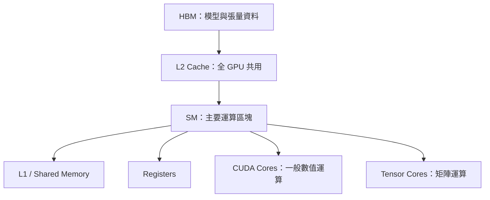
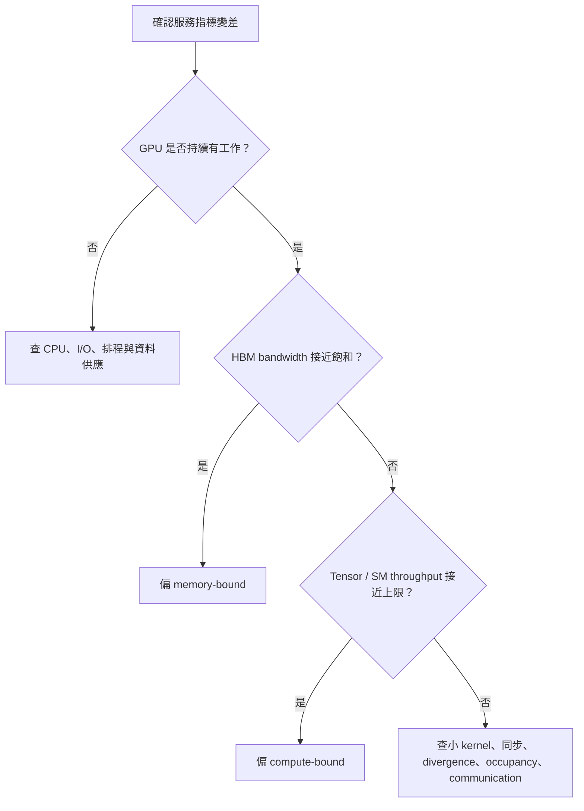

# AI Infra 學習筆記：GPU Architecture and Workload Behavior

> 主題：Learn GPU architecture and workload behavior  
> 學習範圍：SM、CUDA Core、Tensor Core、HBM、Cache、Memory Bandwidth、Compute-bound vs Memory-bound

## 1. 為什麼 AI Infra 工程師需要懂 GPU 架構？

AI Infra 並不只是「替模型準備一張 GPU」。實際部署時，我們通常要回答：

- 為什麼 GPU utilization 很高，吞吐量卻沒有上升？
- 為什麼 batch size 增大後 throughput 變好，但 latency 也明顯上升？
- 為什麼換成算力更高的 GPU，LLM decode 不一定等比例變快？
- 為什麼模型放得進 GPU，服務仍然可能因 KV cache 而 OOM？
- 量化改善的是計算、記憶體容量，還是 memory bandwidth？
- workload 應該 scale up 到更大的 GPU，還是 scale out 到更多 GPU？

要回答這些問題，核心不是只看 GPU 的 FLOPS，而是理解兩條供應鏈：

1. **Compute path**：運算單元能多快完成數學計算。
2. **Memory path**：資料能多快從 HBM 搬到運算單元。

GPU 的實際效能通常由比較慢的那一邊決定。

---

## 2. 先建立一張 GPU 心智模型

以下以 NVIDIA GPU 的常見架構用語為主；不同世代的內部配置會改變，但基本觀念相同。



可以先用工廠來理解：

| GPU 元件 | 工廠比喻 | 主要功能 |
|---|---|---|
| SM | 一個生產車間 | 排程並執行一群 threads |
| CUDA Core | 通用工作台 | FP32、INT 等一般算術運算 |
| Tensor Core | 矩陣專用機台 | 高吞吐量 matrix multiply-accumulate |
| Register | 工人手上的材料 | 最快、容量最小、每個 thread 私有 |
| Shared Memory / L1 | 車間內暫存區 | 同一個 SM 內快速重用資料 |
| L2 Cache | 工廠共用倉庫 | 所有 SM 共用，減少 HBM 存取 |
| HBM | 工廠外的大型倉庫 | 容量大，但距運算單元較遠 |
| Memory Bandwidth | 搬運速度 | 每秒能從記憶體移動多少資料 |

---

## 3. SM：GPU 的基本執行區塊

### 3.1 什麼是 SM？

SM（Streaming Multiprocessor）是 NVIDIA GPU 執行工作的主要硬體區塊。一張 GPU 由許多 SM 組成；每個 SM 內含：

- warp schedulers
- registers
- shared memory / L1 cache
- CUDA Cores
- Tensor Cores
- load/store units
- special function units

CPU 通常用少量、能力強的核心降低單一 thread 的延遲；GPU 則用大量平行執行資源提高總吞吐量。

### 3.2 Thread、Warp、Block、Grid

CUDA 的執行階層如下：

| 層級 | 意義 |
|---|---|
| Thread | 最小程式執行單位 |
| Warp | NVIDIA GPU 一組一起排程的 32 個 threads |
| Block | 一群 threads，可共享 shared memory，會被安排到同一個 SM |
| Grid | 一次 kernel launch 產生的所有 blocks |

簡化流程：

1. CPU 啟動一個 GPU kernel。
2. Kernel 形成 grid，包含許多 thread blocks。
3. Blocks 被派到可用的 SM。
4. SM 將 threads 分成 warps 並排程。
5. Warp 的指令交給 CUDA Core、Tensor Core 或 load/store unit 執行。

### 3.3 SIMT 與 Warp Divergence

GPU 採用 SIMT（Single Instruction, Multiple Threads）模式：同一個 warp 的 threads 通常執行同一條指令，但處理不同資料。

若同一 warp 遇到分支：

```text
if condition:
    path_A()
else:
    path_B()
```

部分 threads 走 A、部分走 B，GPU 可能需要分別執行兩條路徑，暫時遮蔽不屬於該路徑的 threads。這稱為 **warp divergence**，會降低平行效率。

### 3.4 Occupancy 不是越高越好

Occupancy 通常表示 SM 上實際活躍 warps 相對於硬體上限的比例。足夠多的 warps 可以在某個 warp 等待 memory 時，讓 SM 改執行另一個 warp，隱藏 latency。

但 occupancy 不是最終效能指標：

- 太低可能無法隱藏 memory latency。
- 很高也不代表 CUDA/Tensor Cores 有效工作。
- register 或 shared memory 使用量過高，會限制同時駐留的 blocks / warps。
- 某些高效 kernel 即使 occupancy 未滿，也可能已接近計算或頻寬上限。

因此不能只看到 occupancy 低，就直接假設它是 root cause。

---

## 4. CUDA Core 與 Tensor Core

### 4.1 CUDA Core

CUDA Core 是 GPU 內的一般算術執行單元，適合處理：

- scalar/vector arithmetic
- element-wise operation
- control-related computation
- 不適合映射成 Tensor Core 矩陣指令的運算

例如 activation、部分 normalization、indexing 與一般數值操作都可能大量使用 CUDA Cores 或其他 SM 執行單元。

### 4.2 Tensor Core

Tensor Core 是針對矩陣乘加設計的專用單元，核心形式可概念化為：

$$D = A \times B + C$$

神經網路中的 linear layer、convolution、attention 中的矩陣乘法都可受益。Tensor Core 支援的精度依 GPU 世代不同，常見包括 FP16、BF16、TF32、FP8，以及部分整數格式。

### 4.3 兩者的差異

| 比較 | CUDA Core | Tensor Core |
|---|---|---|
| 定位 | 通用算術 | 矩陣乘加專用 |
| 適合 workload | element-wise、一般計算 | GEMM、convolution、attention matrix operations |
| 吞吐量 | 相對一般 | 符合資料型態與形狀時非常高 |
| 使用條件 | 彈性高 | 需要支援的 dtype、shape、layout 與 kernel |
| AI 重要性 | 處理無法矩陣化的部分 | 訓練與推論主要算力來源 |

### 4.4 有 Tensor Core 不等於一定用得到

Tensor Core 利用率可能受到下列因素限制：

- 使用不支援或不理想的 dtype。
- matrix dimensions 沒有良好對齊硬體 tile。
- batch 太小，平行工作不足。
- operator 被切得太碎，kernel launch overhead 高。
- 資料 layout 需要額外轉換。
- workload 其實在等待 HBM，而非等待矩陣計算。

AI Infra 上看到 GPU 使用率高時，仍需確認真正忙的是 Tensor Cores、CUDA Cores，還是 memory subsystem。

---

## 5. GPU Memory Hierarchy

資料越接近運算單元，通常越快、容量也越小：

| 層級 | 範圍 | 特性 | 常見用途 |
|---|---|---|---|
| Registers | 每個 thread | 最快、最小 | 中間運算值 |
| Shared Memory / L1 | 每個 SM | 可由同 block threads 重用 | tiling、局部資料交換 |
| L2 Cache | 全 GPU | 所有 SM 共用 | 重用跨 SM 或近期資料 |
| HBM | GPU device memory | 容量最大、延遲較高 | weights、activations、KV cache |

### 5.1 Register

Register 是 thread 最快的儲存空間。若 kernel 每個 thread 需要太多 registers：

- 同一 SM 能同時容納的 threads / warps 下降。
- occupancy 可能降低。
- 極端情況下資料可能 spill 到更慢的 local memory；名稱雖是 local，實體通常仍在 device memory。

### 5.2 Shared Memory 與 L1 Cache

Shared memory 由程式明確管理，常用來把 HBM 資料載入一次後，在同一 block 內重複使用。矩陣乘法的 tiling 是典型例子：

1. 從 HBM 載入一小塊矩陣 tile。
2. 將 tile 放進 shared memory。
3. 多個 threads 重複使用該 tile 做計算。
4. 減少對 HBM 的重複讀取。

L1 cache 則主要由硬體自動管理。兩者在部分架構上會共享或分配實體資源。

### 5.3 L2 Cache

L2 是整張 GPU 共用的 cache。它可以：

- 減少重複存取 HBM。
- 在不同 SM 間提供共享的 cache 層。
- 對反覆存取 weights、KV cache 或中間資料的 workload 產生影響。

但資料集若遠大於 L2，或存取缺乏 locality，cache hit rate 仍會低。

### 5.4 HBM

HBM（High Bandwidth Memory）是 GPU 主要 device memory，存放：

- model weights
- optimizer states
- gradients
- activations
- temporary buffers
- inference KV cache

HBM 有兩個必須分開看的規格：

| 規格 | 回答的問題 |
|---|---|
| Capacity（GB） | 資料放不放得下？ |
| Bandwidth（GB/s 或 TB/s） | 每秒搬得多快？ |

容量不足會 OOM；頻寬不足則可能讓運算單元等待資料。模型「放得下」不代表「跑得快」。

---

## 6. Memory Bandwidth：AI workload 的另一種算力

Memory bandwidth 表示單位時間內可在 HBM 與 GPU 間傳輸的資料量。簡化估算：

$$\text{Memory time} \approx \frac{\text{Bytes transferred}}{\text{Effective memory bandwidth}}$$

注意應使用實際有效頻寬，而不是只使用規格表上的理論峰值。存取模式、cache、kernel、競爭與硬體利用率都會讓有效值降低。

### 6.1 Latency 與 Bandwidth 不相同

- **Latency**：一次存取要等多久。
- **Bandwidth**：長時間連續搬運時，每秒能搬多少。

像水管一樣，bandwidth 是管徑，latency 是水從一端到另一端所需的時間。GPU 透過大量 warps 與非同步執行隱藏部分 latency，但無法突破 bandwidth 上限。

### 6.2 Coalesced Memory Access

同一 warp 的 threads 若存取連續且對齊的記憶體位置，GPU 可把多個要求合併成較少的 memory transactions。若存取零散，則需要更多 transactions，實際 bandwidth 利用率下降。

因此 layout、stride、padding 與資料排列也會影響效能。

---

## 7. Compute-bound 與 Memory-bound

### 7.1 定義

**Compute-bound**：運算單元已接近飽和，主要時間花在數學計算；增加 FLOPS 或使用更快的 Tensor Core 可能有效。

**Memory-bound**：運算單元經常等待資料，主要限制是 memory bandwidth 或資料移動；單純增加 FLOPS 幫助有限。

有時 workload 也可能是 latency-bound、communication-bound、launch-bound 或 CPU-bound，不能強迫所有問題只分成上述兩類。

### 7.2 Arithmetic Intensity

Arithmetic intensity（運算強度）是判斷瓶頸的核心概念：

$$\text{Arithmetic Intensity} = \frac{\text{Operations}}{\text{Bytes moved from memory}}$$

- 高 arithmetic intensity：同一份資料被重複計算很多次，較可能 compute-bound。
- 低 arithmetic intensity：每搬一批資料只做少量運算，較可能 memory-bound。

### 7.3 Roofline Model

Roofline model 用兩個硬體上限估計 attainable performance：

$$\text{Performance} \leq \min(\text{Peak Compute},\ \text{Memory Bandwidth} \times \text{Arithmetic Intensity})$$

轉折點（ridge point）為：

$$\text{Ridge Point} = \frac{\text{Peak Compute}}{\text{Memory Bandwidth}}$$

- workload 的 arithmetic intensity 低於 ridge point：偏 memory-bound。
- 高於 ridge point：偏 compute-bound。

這也解釋了為什麼只比較兩張 GPU 的峰值 FLOPS 可能誤導：若服務是 memory-bound，更重要的可能是 HBM bandwidth、cache 與資料精度。

### 7.4 常見 operator 傾向

| Workload / Operator | 常見傾向 | 原因 |
|---|---|---|
| 大型 GEMM | Compute-bound | 資料 tile 可重用，計算量高 |
| 小型 GEMM | 可能 memory / launch-bound | 平行度與資料重用不足 |
| Element-wise activation | Memory-bound | 每個元素只做少量運算 |
| Normalization | 常偏 memory-bound | 讀寫量相對運算量大 |
| Embedding lookup | Memory-bound | 隨機讀取、算術量低 |
| LLM prefill | 較偏 compute-bound | 多 token 可形成大型矩陣運算 |
| LLM decode | 常偏 memory-bound | 每一步 token 都要讀取大量 weights / KV cache |
| Multi-GPU all-reduce | Communication-bound | 受 interconnect 與 collective efficiency 限制 |

這些是常見傾向，不是固定結論；模型大小、batch、sequence length、dtype、kernel 與 GPU 型號都會改變結果。

---

## 8. 把概念套到 LLM Inference

### 8.1 Prefill Phase

Prefill 一次處理 prompt 中的多個 tokens，矩陣通常較大，Tensor Core 較容易被充分利用。特性常包括：

- parallelism 高
- arithmetic intensity 較高
- 常較接近 compute-bound
- 影響 Time to First Token（TTFT）

Prompt 越長，prefill 計算量通常越大。

### 8.2 Decode Phase

Decode 每一步通常為每個 request 產生一個新 token。每一步仍需讀取大量模型權重，而可合併的計算相對較小，所以常見特性是：

- GEMM dimensions 較小
- arithmetic intensity 較低
- 容易受 HBM bandwidth 限制
- 影響 Inter-Token Latency（ITL）與 tokens/s

Continuous batching 能把多個 request 的 decode 工作合併，增加矩陣尺寸與資料重用，改善 GPU efficiency；代價是排程複雜度與可能的 latency trade-off。

### 8.3 KV Cache

Self-attention 需要使用之前 tokens 的 key/value。若每生成一個 token 都重新計算全部歷史內容會非常昂貴，所以推論系統會保留 KV cache。

KV cache 的影響：

- 占用 HBM capacity。
- 隨 batch size 與 sequence length 增長。
- decode 時需要讀取，增加 memory traffic。
- 可能產生 fragmentation，促使系統採用 paged KV cache。

概念上的容量關係：

$$\text{KV cache size} \propto \text{layers} \times \text{tokens} \times \text{KV heads} \times \text{head dimension} \times 2 \times \text{bytes per element}$$

其中 $2$ 代表 K 與 V。實際公式會因 MHA、GQA、MQA、layout 與框架實作而不同。

### 8.4 為什麼量化常能改善 decode？

若 weights 從較高位元精度轉成較低位元：

- 模型占用的 HBM capacity 下降。
- 每次讀取 weights 所需 bytes 下降。
- memory-bound decode 可能因此加速。
- 可容納更大的 batch 或更多 KV cache。

但量化也可能帶來 dequantization、額外 kernel、精度損失，以及硬體是否原生支援等問題，所以加速幅度不會只等於位元數縮減比例。

---

## 9. 訓練 Workload 的資料與記憶體壓力

訓練除了 weights，還要儲存 gradients、activations 與 optimizer states。以 Adam 類 optimizer 為例，optimizer states 可能比單純模型 weights 占用更多記憶體。

主要階段：

1. **Forward pass**：計算輸出並保留 backward 所需 activations。
2. **Backward pass**：計算 gradients，通常計算與記憶體壓力都高。
3. **Optimizer step**：讀寫 parameters、gradients 與 optimizer states。

常見 Infra 技術與其主要目的：

| 技術 | 主要改善 |
|---|---|
| Mixed precision | 減少 memory、提升 Tensor Core throughput |
| Activation checkpointing | 用額外重算換取較少 activation memory |
| Gradient accumulation | 用多個 micro-batches 模擬較大 batch |
| Data parallelism | 複製模型、分散 batches；需同步 gradients |
| Tensor parallelism | 拆分單層計算；增加 device 間通訊 |
| Pipeline parallelism | 按 layers 分 stage；可能產生 pipeline bubbles |
| ZeRO / FSDP | 分片 parameters、gradients、optimizer states |

這些技術本質上都在交換四種資源：compute、memory capacity、memory bandwidth、network communication。

---

## 10. 如何診斷 GPU Workload

### 10.1 不要只看單一 GPU Utilization

「GPU utilization 95%」通常只表示觀測區間內 GPU 有工作，不代表：

- Tensor Cores 接近峰值。
- HBM bandwidth 已飽和。
- kernel execution 有效率。
- end-to-end application 沒有 CPU 或網路瓶頸。

診斷應同時觀察：

| 類別 | 問題 | 指標例子 |
|---|---|---|
| End-to-end | 使用者實際得到什麼？ | TTFT、ITL、latency、tokens/s、requests/s |
| Compute | 運算單元是否飽和？ | achieved FLOPS、Tensor Core utilization、SM throughput |
| Memory | 是否在等待資料？ | HBM bandwidth utilization、DRAM throughput、L2 hit rate |
| Execution | kernel 是否有效？ | occupancy、warp stall reasons、kernel duration、launch count |
| Capacity | 是否接近 OOM？ | allocated/reserved HBM、KV cache usage |
| Host | GPU 是否在等 CPU？ | CPU utilization、data loader time、host-to-device copy |
| Network | 多 GPU 是否在等通訊？ | NCCL time、all-reduce time、interconnect throughput |

### 10.2 初步判斷流程



### 10.3 常見優化方向

| 判斷 | 可優先嘗試 |
|---|---|
| Compute-bound | 更低精度、Tensor Core kernel、operator fusion、更強算力、改善 shape |
| Memory-bound | 量化、fusion、減少讀寫、提高資料重用、改善 layout、選擇高頻寬 GPU |
| Launch-bound | fusion、CUDA Graphs、減少極小 kernels |
| Capacity-bound | 量化、KV cache 管理、offloading、parallelism、checkpointing |
| Communication-bound | 改善 topology、NCCL tuning、重疊 compute/communication、調整 parallel strategy |
| CPU / input-bound | data loader、pinned memory、prefetching、batching、CPU profiling |

Operator fusion 對 memory-bound workload 特別重要。例如原本三個 operators 各自把資料寫回 HBM，再由下一個讀取；融合後可讓中間值留在 registers 或 cache，減少 memory traffic 與 kernel launches。

---

## 11. 一個簡化案例：為什麼更高 FLOPS 沒有明顯加速？

假設 LLM decode 每生成一個 token，都需要大量讀取模型 weights，但 batch size 很小：

1. Tensor Core 很快完成目前拿到的矩陣運算。
2. 下一批資料尚未從 HBM 到達，Tensor Core 等待。
3. 換成峰值 FLOPS 更高、但 memory bandwidth 相近的 GPU。
4. 計算單元雖然更強，等待資料的時間沒有明顯縮短。
5. 因此 tokens/s 不會按照 FLOPS 比例成長。

可考慮的改善：

- 增加 batch 或使用 continuous batching，讓 weights 能服務更多 tokens。
- 使用較低位元 weights，減少每步需要搬運的 bytes。
- 使用 optimized/fused kernels，減少中間資料讀寫。
- 比較 GPU 時加入 HBM bandwidth，而非只看峰值 Tensor FLOPS。

這就是 AI Infra capacity planning 必須理解 workload behavior 的原因。

---

## 12. Hands-on 學習練習

### Exercise A：建立硬體規格表

選擇兩到三款實際可能使用的 GPU，整理：

- architecture generation
- SM count
- Tensor Core generation / supported dtypes
- HBM capacity
- peak memory bandwidth
- peak compute throughput（須標註 dtype）
- interconnect

最後回答：哪一張較適合大模型訓練？哪一張較適合 memory-bound inference？規格本身仍不足以確定什麼？

### Exercise B：用 PyTorch Profiler 分析模型

選一個小型 Transformer，分別執行：

- batch size：1、8、32
- sequence length：128、512、2048
- dtype：FP32、FP16/BF16（視硬體支援）

記錄：

- latency
- throughput
- GPU memory usage
- 最耗時 operators
- batch 增加後，GPU 是否更有效率

### Exercise C：比較三類 kernels

用 profiler 比較：

1. 大型 matrix multiplication
2. element-wise addition / activation
3. embedding lookup

預測並驗證各自較接近 compute-bound 或 memory-bound。

### Exercise D：觀察 LLM Prefill 與 Decode

使用任一 inference engine，分別改變：

- input length
- output length
- concurrent requests
- batch policy

記錄 TTFT、ITL、tokens/s 與 HBM usage，解釋哪一個設定主要增加 prefill 壓力，哪一個增加 decode / KV cache 壓力。

---

## 13. 完成這個主題後，應該能回答的問題

- [ ] 我能畫出 HBM → L2 → L1/shared memory → register → compute unit 的資料路徑。
- [ ] 我能說明 SM、warp、block 之間的關係。
- [ ] 我知道 CUDA Core 與 Tensor Core 的定位差異。
- [ ] 我知道 HBM capacity 與 bandwidth 是兩種不同限制。
- [ ] 我能用 arithmetic intensity 解釋 compute-bound 與 memory-bound。
- [ ] 我能說明為什麼大型 GEMM 通常比 element-wise operation 更偏 compute-bound。
- [ ] 我能說明 LLM prefill 與 decode 的 workload 差異。
- [ ] 我能說明 KV cache 如何影響 HBM capacity 與 bandwidth。
- [ ] 我不會只用 GPU utilization 判定效能是否良好。
- [ ] 我能根據瓶頸提出對應優化，而不是一律換更高 FLOPS 的 GPU。

---

## 14. 重點速查表

| 關鍵詞 | 一句話理解 |
|---|---|
| SM | 執行 warps、容納計算與記憶體資源的主要 GPU 區塊 |
| Warp | NVIDIA GPU 一次排程的一組 32 threads |
| CUDA Core | 通用算術執行單元 |
| Tensor Core | 高吞吐量矩陣乘加專用單元 |
| HBM Capacity | GPU 能放多少 weights、activations、KV cache |
| HBM Bandwidth | GPU 每秒能搬多少資料 |
| Cache | 透過保存近期或重用資料，減少 HBM traffic |
| Arithmetic Intensity | 每搬一 byte 資料能做多少運算 |
| Compute-bound | 瓶頸主要在運算吞吐量 |
| Memory-bound | 瓶頸主要在資料搬運 |
| Prefill | 平行處理 prompt，通常更容易使用大量計算資源 |
| Decode | 逐 token 生成，常受到 memory bandwidth 限制 |
| KV Cache | 保存歷史 token 的 K/V，換取避免重算，但消耗 HBM |
| Fusion | 合併 operators，減少 kernel launch 與中間資料讀寫 |

---

## 15. 下一步銜接主題

學完本篇後，建議依序往下延伸：

1. CUDA execution model 與 kernel optimization
2. PyTorch Profiler、Nsight Systems、Nsight Compute
3. LLM serving：continuous batching、paged attention、KV cache management
4. Multi-GPU interconnect：PCIe、NVLink、NVSwitch、RDMA
5. Distributed training：DP、TP、PP、ZeRO/FSDP
6. GPU scheduling：Kubernetes device plugin、MIG、time-slicing、gang scheduling
7. Capacity planning：latency SLO、throughput、utilization、cost per token

這些主題會把單張 GPU 的理解，逐步延伸到完整的 AI cluster 與 production serving system。
